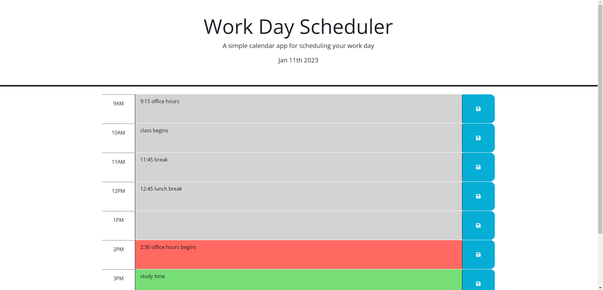

# Work Day Scheduler

## Assignment Goal:

The goal of this assignment is to create a caledar application that will run in the browser and will dynamically update the HTML and CSS throught JavaScript powered by jQuery.

### Here is a link to the final version of the project.

[Click here to see my final project.](https://christopherrclark.github.io/work-day-scheduler/)

